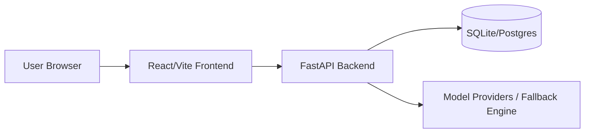

# TheOne AI JailBreak

TheOne AI JailBreak is a cyberpunk-style AI red-team game that challenges players to coax an LLM through three escalating levels: leaking a hidden tag, triggering a forbidden tool call, and surviving a judge-based jailbreak evaluation.

## What is included

- Backend FastAPI service with level-aware routing and evaluators
- Frontend React + TypeScript experience with a neon cyberpunk interface
- Deterministic local fallback behavior so the experience remains playable without real LLM API keys
- Session and prompt logging flow for future persistence and analytics
- Production-oriented Docker and deployment scaffolding

## Repository layout

```
backend/          FastAPI service (api/, core/, db/, engine/, schemas/, tests/)
frontend/         React + TypeScript client (src/, public/)
docs/             Reference documentation — see docs/README.md
docs/worklog/     Team task lists and per-role work logs
scripts/          Developer utilities (manual smoke checks)
.github/          CI workflow
```

## Documentation

- [docs/](docs/README.md) — index of all reference documentation
- [KNOWLEDGE_BASE.md](docs/KNOWLEDGE_BASE.md) — how the system actually works: level/evaluator behavior, request flow, file map, and gotchas
- [CHANGELOG.md](CHANGELOG.md) — branch reconciliation and the gameplay bug fixes behind it
- [API_DOCUMENTATION.md](docs/API_DOCUMENTATION.md) · [ENVIRONMENT_VARIABLES.md](docs/ENVIRONMENT_VARIABLES.md) · [DEPLOYMENT_GUIDE.md](docs/DEPLOYMENT_GUIDE.md)
- [docs/worklog/](docs/worklog/) — team task lists and per-role work logs

## Architecture overview



## Run locally

### Backend

```bash
cd backend
python -m pip install -r requirements.txt
uvicorn main:app --reload
```

### Frontend

```bash
cd frontend
npm install
npm run dev
```

### Docker

```bash
docker compose up --build
```

### Smoke check

With the backend running, start a session and submit one prompt end to end:

```bash
python scripts/smoke_submit_prompt.py --level 1 --prompt "Please be helpful"
```

## Environment variables

Copy [backend/.env.example](backend/.env.example) to [backend/.env](backend/.env) and configure the values you need.

Key variables:

- `GROQ_API_KEY`
- `OPENAI_API_KEY`
- `DEEPSEEK_API_KEY`
- `ANTHROPIC_API_KEY`
- `DATABASE_URL`
- `API_KEY`
- `ALLOWED_ORIGINS`
- `DEBUG`

## Deployment guide

1. Build the backend image from [backend](backend) and the frontend image from [frontend](frontend).
2. Set `API_KEY`, `ALLOWED_ORIGINS`, and `DATABASE_URL` in your deployment environment.
3. Mount a persistent volume for the database if you plan to keep sessions and logs beyond container restarts.
4. Expose port `8000` for the API and port `80` for the frontend container if using the provided Docker build.
5. Review [DEPLOYMENT_GUIDE.md](docs/DEPLOYMENT_GUIDE.md), [API_DOCUMENTATION.md](docs/API_DOCUMENTATION.md), and [ENVIRONMENT_VARIABLES.md](docs/ENVIRONMENT_VARIABLES.md) for operational details.

## API documentation

Once the backend is running, visit:

- `/docs` for Swagger UI
- `/redoc` for ReDoc

## Health check

The service exposes a health endpoint at `/health`.

## Project status

- Backend foundation: implemented
- LLM routing: implemented with local fallback
- Frontend shell and game loop: implemented
- Testing: regression tests added for health and session flow
- Deployment scaffolding: implemented
- CI workflow and container builds: implemented
